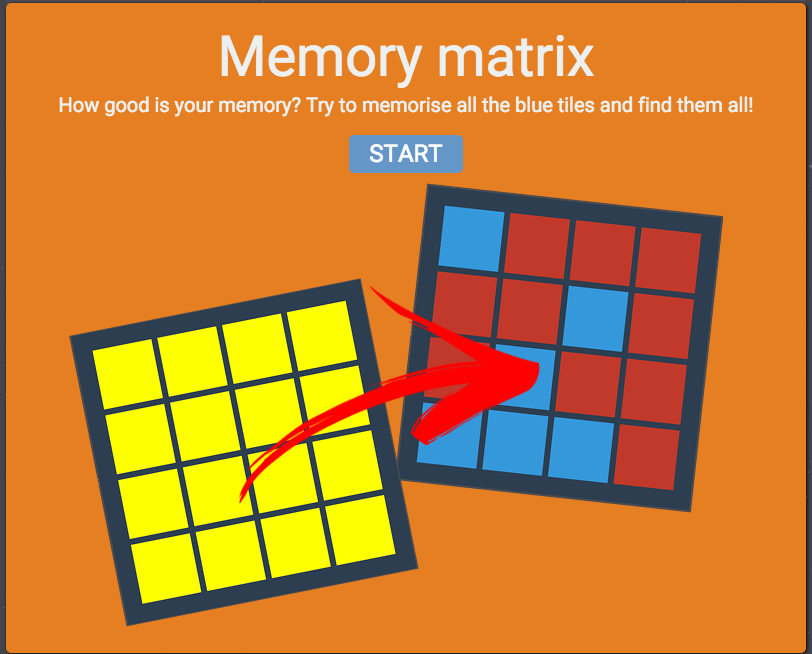
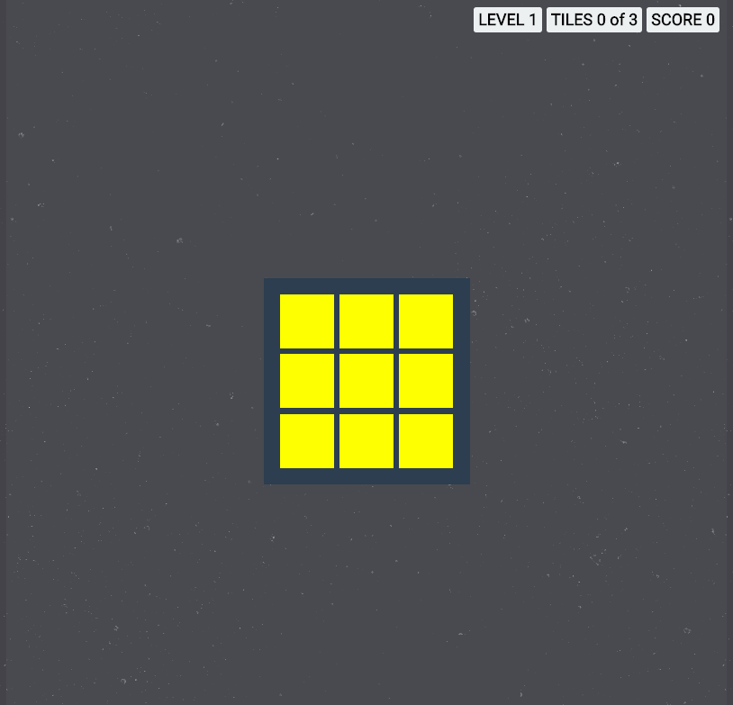
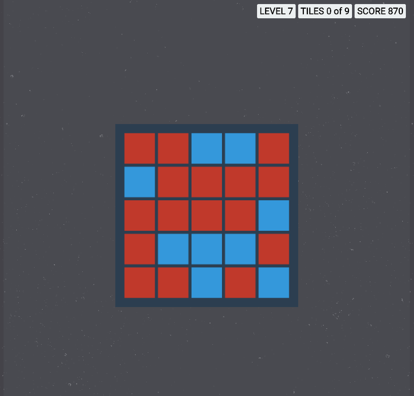
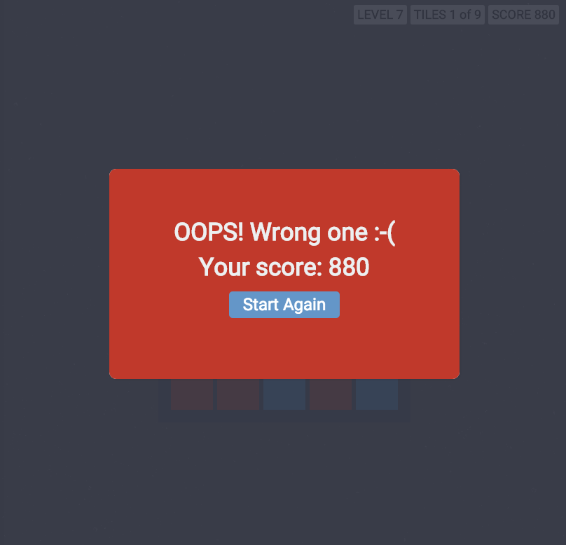

# MEMORY MATRIX
MEMORY MATRIX is a browser game, where you have to memorise pattern of blue tiles and then found them.
This game improve spatial recall.
Spacial recall is a form of memory involved in tracking location and position within an environment.

## Technical details
The whole game was written in a pure JavaScript with React framework.

There are  5 React components in the game:  
  - **App**. Placeholder for games (more coming soon)
  - **Game**. All the game logic is in this component
  - **Board**. Board where all the rendering of the tiles occurs
  - **Info**. Information about the game (score, amount of tiles)
  - **Tile**. Tiles of the board

## Live
[Click here to play](https://mexxxxx.github.io/memory_matrix)

## Screenshot

## Credits
[Lumosity](https://www.lumosity.com)
